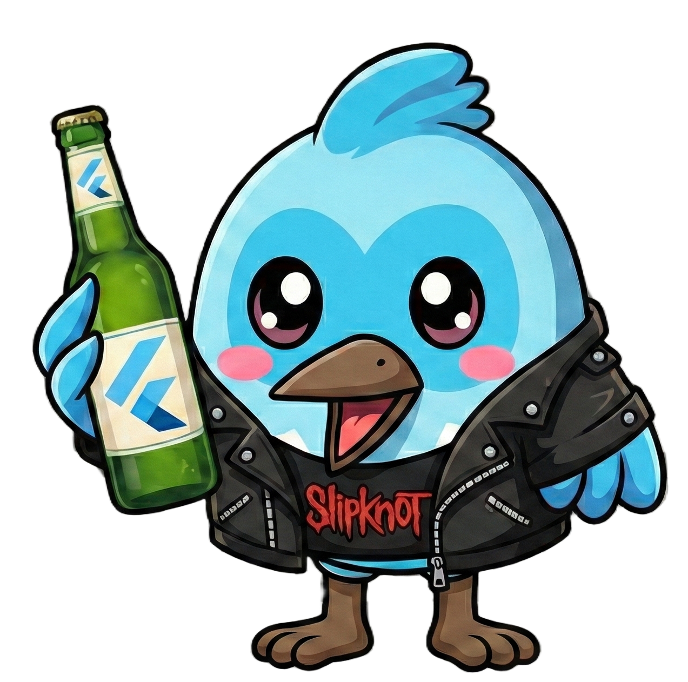

<p align="center">
  
</p>

<p align="center">
  <a href="https://github.com/sponsors/canusdev">
    
  </a>
</p>

# Dashpub UI

The frontend dashboard for the Dashpub package registry, built with Flutter Web.

## Overview

Dashpub UI provides a modern, responsive interface for managing packages, teams, and users in your private registry. It connects to the `dashpub_server` via the `dashpub_api`.

### Tech Stack

-   **Framework**: Flutter (Web target)
-   **UI Library**: `shadcn_flutter` (Port of shadcn/ui)
-   **State Management**: `flutter_bloc`
-   **Routing**: `go_router`
-   **Icons**: Bootstrap Icons

## Features

-   **Authentication**: Login and registration.
-   **Package Discovery**: Browse, search, and view package details (readme, changelog, versions).
-   **Team Management**: Create teams, add members, and manage permissions.
-   **Admin Console**:
    -   User management (promote/demote admins, deactivate users).
    -   Global registry settings.

## Docker Deployment
For deployment instructions, including how to run with Docker/Docker Compose, please refer to the [Main Repository README](../../README.md#docker-deployment).

## Getting Started

### Prerequisites

-   Flutter SDK installed.
-   `dashpub_server` running (default: `http://localhost:4000`).

### Development
1.  Get dependencies:
    ```bash
    flutter pub get
    ```

2.  Run the app with a custom API URL (e.g., targetting your local server):
    ```bash
    flutter run -d chrome --dart-define=DASHPUB_API_URL=http://localhost:4000
    ```
    *Note: If `DASHPUB_API_URL` is not provided, the client will attempt to use the same host/port where the UI is served (valid for production builds).*
